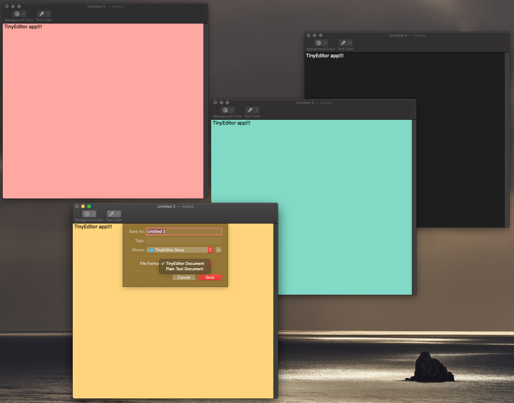

# TinyEditor - Learn to build a document based Mac app

Welcome to another macOS tutorial! In this post we are about to learn how to create a macOS application that belongs to a unique category of apps; a category that is quite common but also quite important, and contains a large number of existing and new macOS apps. We are going to learn how to create a document based application.

For the full tutorial, please refer to the following link:

https://www.appcoda.com/document-based-app-macos/
